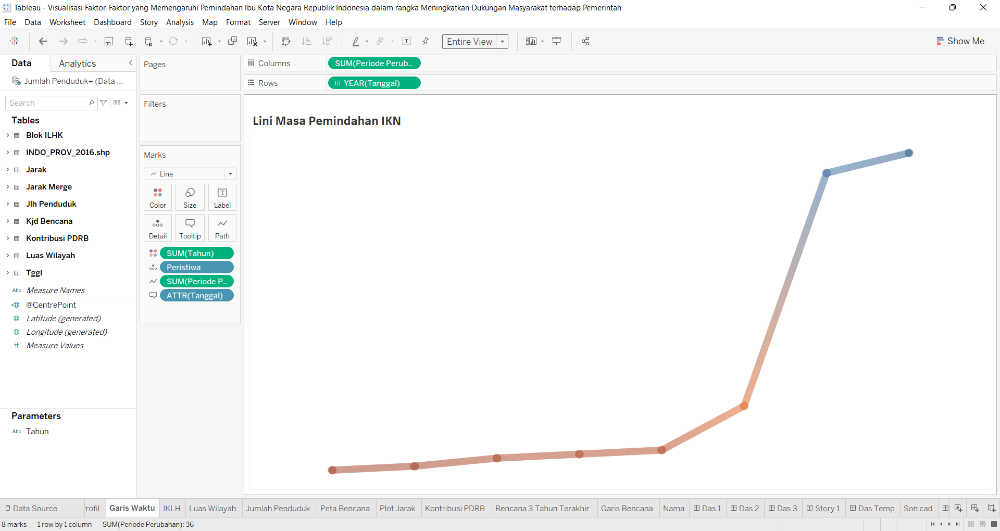
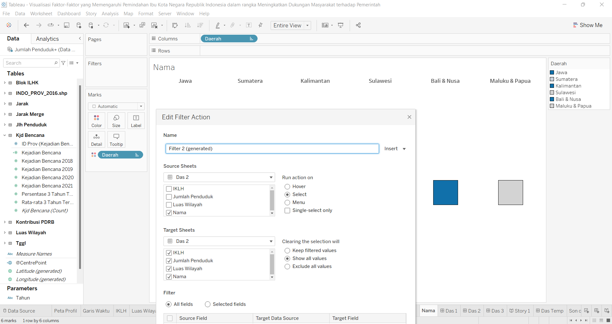

[![MIT License][license-shield]][license-url]

<!-- PROJECT LOGO -->
 

  

<!-- ABOUT THE PROJECT -->
# Visualisasi Faktor-Faktor yang Memengaruhi Pemindahan Ibukota Negara Republik Indonesia dalam rangka Meningkatkan Dukungan Masyarakat terhadap Pemerintah 

## Latar Belakang

Pemindahan Ibu Kota Republik Negara Indonesia bukan merupakan sesuatu yang baru. Rencana ini sudah ada sejak zaman kolonialisme, hingga pada akhirnya pelaksanaan pemindahan ibu kota negara ini diumumkan kepada masyarakat Indonesia pada tanggal 16 Agustus 2019, oleh Presiden Joko Widodo. Pada prakteknya, pemindahan ibu kota negara ini menuai sejumlah dukungan maupun kecaman dari masyarakat. Berimbangnya proporsi pendapat yang pro dan kontra menggambarkan kondisi masyarakat yang masih belum sepenuhnya percaya kepada pemerintah. Oleh karena itu, diperlukan sosialisasi serta promosi yang lebih baik mengenai pemindahan ibu kota negara. Sosialisasi tersebut salah satunya dapat dilakukan dengan membangun dasbor informasi interaktif yang dapat diakses oleh masyarakat secara daring.  Dasbor informasi yang dihasilkan dalam penelitian ini menampilkan berbagai faktor yang dipercaya memengaruhi keputusan dilakukannya pemindahan ibu kota negara.

Pada penelitian ini, Tableau Desktop digunakan untuk membuat visualisasi, sedangkan Tableau Public digunakan dalam menyajikan visualisasi yang telah tersedia. Hasil evaluasi dasbor ini menunjukkan bahwa dasbor informasi dapat digunakan dengan baik oleh kedua kelompok responden yang memiliki pandangan berbeda tentang adanya pemindahan ibukota negara. Dasbor informasi interaktif ini diharapkan dapat meningkatkan pemahaman serta dukungan masyarakat terhadap pemerintah, khususnya mengenai agenda pemindahan ibukota negara dari Jakarta ke Kalimantan Timur, yang secara berkala sedang terus dilaksanakan. 

(<a href="#top">1</a>)

## Tujuan

Berdasarkan latar belakang yang telah dijelaskan, tujuan dari penelitian ini adalah sebagai berikut. 
1.	Membuat visualisasi data faktor-faktor yang memengaruhi kepindahan ibukota negara berdasarkan provinsi di Indonesia.
2.	Membangun dasbor informasi yang dapat diakses oleh masyarakat dengan mudah.
3.	Mengetahui hasil evaluasi serta perbedaan persepsi penilaian visualisasi pada kedua kelompok responden

(<a href="#top">2</a>)

## Hasil dan Pembahasan

Hasil dari penelitian ini berupa dasbor informasi interaktif yang menampilkan data faktor-faktor yang dipercaya memengaruhi keputusan pemerintah dalam melakukan pemindahan ibukota negara berdasarkan provinsi di Indonesia. 
1. Dasbor dirancang dengan mengusung konsep bercerita agar isinya dapat dimengerti oleh lebih banyak kalangan masyarakat, tidak hanya kelompok akademis. 
2. Pemilihan warna di dalam dasbor ini juga memperhitungkan kondisi buta warna. Warna yang digunakan terbatas pada nuansa biru dan oranye, yang berdasarkan beberapa sumber, lebih ramah bagi penyintas buta warna. 
3. Dasbor ini akan optimal apabila ditampilkan dengan layar beresolusi HD (1920 x 1080).

Visualisasi dapat diakses pada link di bawah ini:

* [Tautan hasil visualisasi menggunakan Tableau](https://public.tableau.com/app/profile/alfonsius.berly/viz/VisualisasiFaktor-FaktoryangMemengaruhiPemindahanIbuKotaNegaraRepublikIndonesiadalamrangkaMeningkatkanDukunganMasyarakatterhadapPemerintah/Story1)

(<a href="#top">3</a>)

<!-- GETTING STARTED -->
## A.  Tampilan 1

Dasbor informasi interaktif yang dibangun terdiri dari 3 tampilan utama. Secara umum, dapat diamati bahwa terdapat 5 container utama. Container 1 berisi header dasbor, sedangkan 4 container yang lainnya digunakan untuk menampilkan konten informasi. Tampilan 1 pada dasbor ini merupakan bagian pembukaan yang memuat tentang latar belakang serta lini masa pemindahan IKN. 
  

  

  
### 1. Lini Masa

Berikut tampilannya dan data yang digunakan
  
  
  

  

  

Berikut aksi yang dapat dilakukan
  
  

  

  

### 2. Peta Profil

Berikut tampilannya dan data yang digunakan
  
  
  

  

  
Berikut aksi yang dapat dilakukan  
  
  

  

  

## B.  Tampilan 2

Secara umum, dapat diamati bahwa sama seperti tampilan 1, tampilan 2 memiliki 5 container utama. Container 1 berisi header dasbor, sedangkan 4 container yang lainnya digunakan untuk menampilkan konten informasi. Perbedaanya, pada header tampilan 2, terdapat filter yang dapat digunakan. Filter tersebut adalah kelompok daerah dan tahun. Apabila filter diklik, maka peta dan tree map akan menampilkan informasi yang spesifik berdasarkan kategori yang dipilih.
  

  

  
### 1. Peta IKLH

Berikut tampilannya dan data yang digunakan
  
  
  

  

  

Berikut aksi yang dapat dilakukan serta cara kalkulasi variabel
  
  

  

  

### 2. Tree Map Luas Wilayah

Berikut tampilannya dan data yang digunakan
  
  
  

  

  

### 3. Tree Map Jumlah Penduduk

Berikut tampilannya dan data yang digunakan
  
  
  

  

  

Berikut aksi yang dapat dilakukan serta cara kalkulasi variabel
  
  

  

  

Berikut aksi dengan klik filter daerah. Contoh: Jawa
  
  

  

  

Berikut aksi dengan klik konten (highlight).
  
  

  

  

## C.  Tampilan 3

Secara umum, dapat diamati bahwa tampilan 3 memiliki tata letak yang mirip dengan 3. Container 1 terdapat filter yang dapat digunakan. Filter tersebut adalah kelompok daerah dan tahun. Apabila filter diklik, maka peta kejadian bencana, bubble map, tdot plot, serta statistik kebencanaan akan menampilkan informasi yang spesifik berdasarkan kategori yang dipilih.

  

  

  

### 1. Peta Kejadian Bencana

Berikut tampilannya dan data yang digunakan
  
  
  

  

  

Berikut aksi yang dapat dilakukan serta cara kalkulasi variabel
  
  

  

  

### 2. Heat Map data Tunggal

Berikut tampilannya dan data yang digunakan
  
  
  

  

  

### 3. Bubble Map Kontribusi PDB

Berikut tampilannya dan data yang digunakan
  
  
  

  

  

Berikut aksi yang dapat dilakukan serta cara kalkulasi variabel
  
  

  

  

### 4. Garis Kejadian Bencana

Berikut tampilannya dan data yang digunakan
  
  
  

  

  

### 5. Dot Plot Jarak

Berikut tampilannya dan data yang digunakan
  
  
  

  

  

Berikut aksi dengan klik filter daerah. Contoh: Sulawesi
  
  

  

  

Berikut aksi dengan klik konten (highlight).
  
  

  

  

### Lainnya

Berikut tampilannya bar filter nama dibentuk
  
  
  

  

  

Berikut contoh set action di menu worksheet -> action -> add action
  
  

  

  

### Selesai

